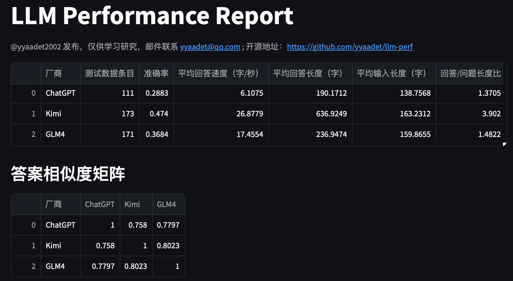
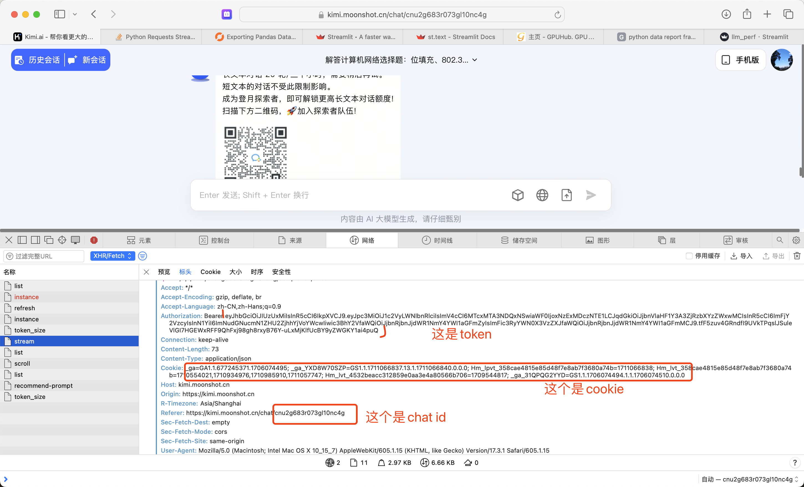
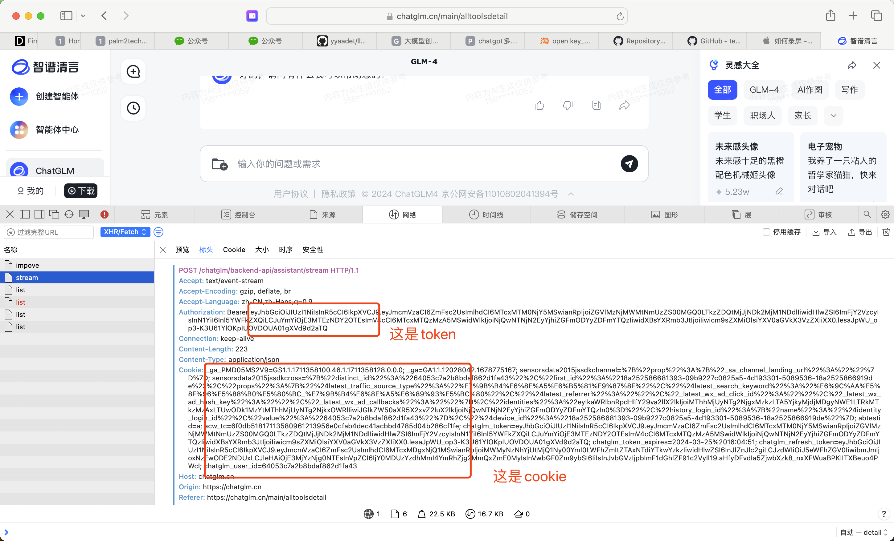
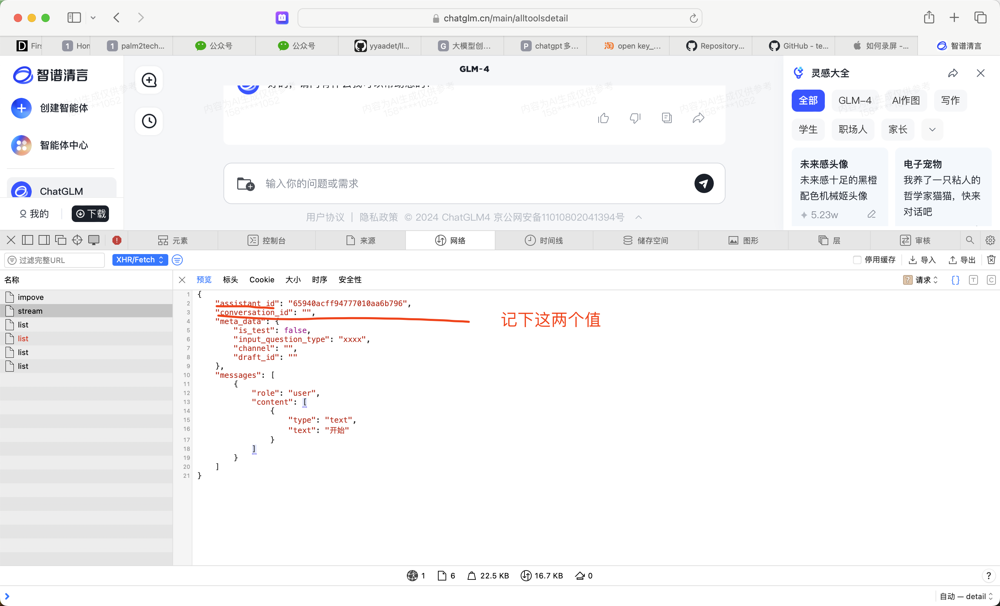
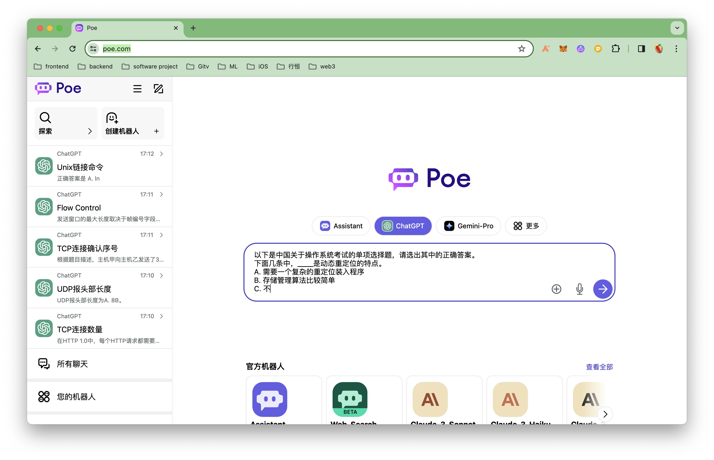

# llm-perf
LLM performance auto test. Get insight and replay evaluation with a little time.

本项目的目标是打造一个从用户使用的角度出发的、可复现的、自动化程度高的大模型效果评测工具。项目将会包括使用的测试数据、测试代码、测试报告。

## 数据源

- CEval的val数据集

## 支持大模型

- gpt-3.5-turbo
- Kimi
- GLM4
- 阶跃星辰
- 文心一言 3.5
- Minimax

## 运行Kimi测试

需要安装有python3.11版本。

- `cd llm-perf`
- `pip install -r requirements.txt`
- 修改`test_kimi.sh`里面的token与cookie值

使用Safari或Chrome登陆进网站: `https://kimi.moonshot.cn`, 随便输入一个文字，用来启动一个新会话。如下图：

用新的token、cookie、chat_id替换脚本`test_kimi.sh`里面的值

## 运行GLM4测试

- `cd llm-perf`
- `pip install -r requirements.txt`
- 修改`test_glm4.sh`里面的
    - token
    - cookie
    - assistant_id
    - conversion_id

## 运行gpt-3.5-turbo测试

不需要openai的api key。

- `cd llm-perf`
- `pip install -r requirements.txt`
- `python run.py chatgpt`。第一次启动，需要手工登陆一下。命令启动成功，会打开一个浏览器，手工登陆一下poe.com网站，然后再运行一下刚才的那个命令。

## 运行阶跃星辰测试

- `cd llm-perf`
- `pip install -r requirements.txt`
- 修改`test_step.sh`里面的
    - token
    - cookie
    - chat_id 
    - appid 
- 运行 `./test_step.sh`

## 运行文心一言3.5测试

只需要用户名与密码就可以。

- `cd llm-perf`
- `pip install -r requirements.txt`
- `python run.py yiyan --username {} --password {}`。输入你自己的用户名与密码就可以开始测试了。

## 查看报告

- `cd streamlit`
- `pip install -r requirements.txt`
- `streamlit run llm_perf.py`

测试结果明细位于`datasets/`

## 友情赞助

