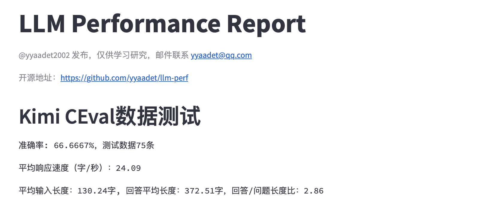

# llm-perf
LLM performance auto test. Get insight and replay evaluation with a little time.
本项目的目标是打造一个可复现的、自动化程度高的大模型效果评测工具。项目将会包括使用的测试数据、测试代码、测试报告。

## 数据源

- CEval的val数据集

## 运行Kimi测试

需要安装有python3.11版本。

- `cd llm-perf`
- `pip install -r requirements.txt`
- 修改`test_kimi.sh`里面的token与cookie值

使用Safari或Chrome登陆进网站: `https://kimi.moonshot.cn`, 随便输入一个文字，用来启动一个新会话。如下图：

用新的token、cookie、chat_id替换脚本`test_kimi.sh`里面的值

## 查看kimi报告

- `cd streamlit`
- `pip install -r requirements.txt`
- `streamlit run llm_perf.py`

## 友情赞助

